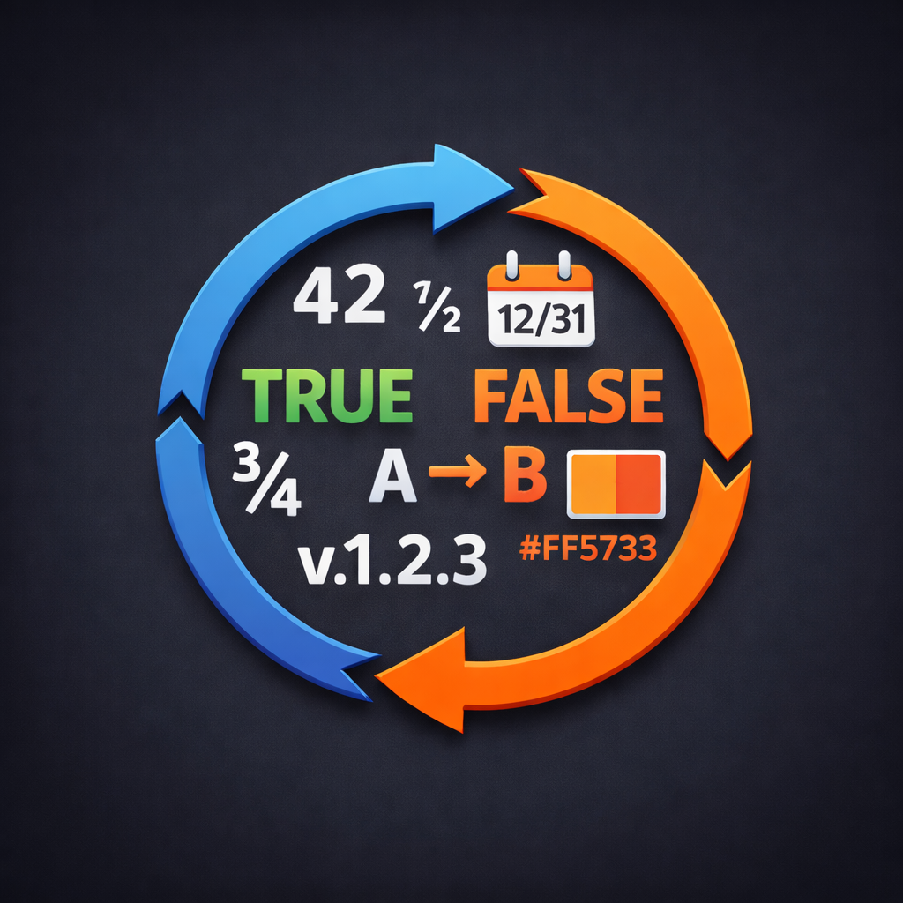

<div align="center">
  
  <h1>value-cycle</h1>
  
</div>

Cycle or nudge values on the line (at cursor or first match) or in the selection. No default keybindings.

## Rule types

Rules are tried in order; the first matching type wins.

| Type | Description | Options |
|------|--------------|---------|
| boolean | `false` ⇄ `true` | — |
| operatorPair | Toggle between two strings | `pair: [string, string]` e.g. `["&&", "\|\|"]` |
| quote | Toggle `'…'` ⇄ `"…"` (escape/unescape inner) | — |
| nary | Integers in base 2–36 | `base` (default 10) |
| fraction | Decimal numbers | `step` (default 1) |
| letters | Single letter a–z / A–Z | — |
| hexColor | `#rgb` or `#rrggbb` | — |
| semver | `x.y.z` bump segment | `segment`: `"major"` \| `"minor"` \| `"patch"` |
| date | ISO date, ± days | — |
| datetime | Date + time, ± unit | `unit`: `"day"` \| `"minute"` \| `"hour"` |
| constants | Cycle through a list | `list: string[]` |

Default `value-cycle.rules` order: boolean → operatorPair → quote → nary → fraction → letters → hexColor → semver (date, datetime, constants are available but not in the default list).

## Settings

- **value-cycle.rules** – Array of `{ type, options?, when?: { languageId?, visualOnly? } }`. Defines which types are active and in what order.
- **value-cycle.disabledTypes** – Array of type names to disable (e.g. `["date", "datetime"]`). Types in this list are removed from the effective rules. Lets you turn off a type without editing the full rules array.

## Keybindings

No keybindings are contributed. Add in Keyboard Shortcuts (JSON):

- **Increment**: `value-cycle.cycle` with `args: { "direction": "increment", "count": 1 }`
- **Decrement**: `args: { "direction": "decrement", "count": 1 }`
- **With count**: e.g. `"count": 5`
- **Global** (all matches in highlighted range): `args: { "direction": "increment", "global": true }`

Example:

```json
[
  { "key": "ctrl+a", "command": "value-cycle.cycle", "args": { "direction": "increment" }, "when": "editorTextFocus" },
  { "key": "ctrl+x", "command": "value-cycle.cycle", "args": { "direction": "decrement" }, "when": "editorTextFocus" }
]
```

## Behavior

- **Current line (no highlight)**: target the value under the cursor, or the first match on the line. After edit, cursor moves to the start of the edited match only when you “jumped” to it (not when the match was under the cursor).
- **Highlighted text**: operate on the highlighted range; with `global: true`, all rule matches inside that range are updated.

## Acknowledgement

Inspired by [dial.nvim](https://github.com/monaqa/dial.nvim). Neovim had it; we missed it in VS Code, so here it is.

## License
[MIT](LICENSE)